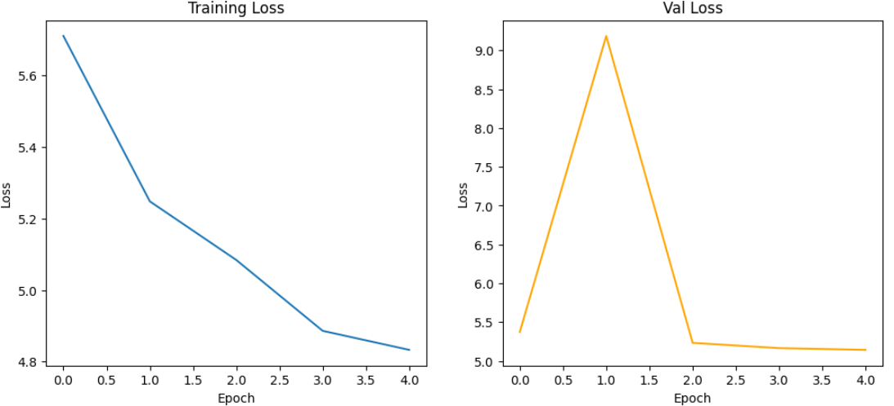
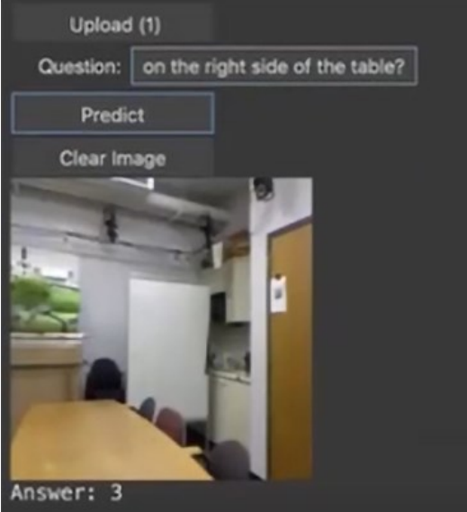

# Visual Question Answering (VQA)

## **Deskripsi Projek**
Projek ini bertujuan untuk membangun model Visual Question Answering (VQA) yang dapat menjawab pertanyaan berdasarkan gambar yang diberikan. Model ini menggabungkan informasi visual dari gambar dan informasi tekstual dari pertanyaan untuk menghasilkan jawaban yang sesuai. Projek ini menggunakan dataset yang berisi pasangan gambar, pertanyaan, dan jawaban.

Projek ini dibuat dengan menggunakan:
- **Python** sebagai bahasa pemrograman utama.
- **PyTorch** sebagai framework deep learning.
- **Spacy** untuk tokenisasi teks.
- **CNN arsitektur ResNet50** sebagai encoder gambar.
- **LSTM** untuk memproses teks pertanyaan.

---

## **Langkah-Langkah Projek**
Berikut adalah langkah-langkah yang dilakukan dalam projek ini:

### 1. **Persiapan Data**
   - Membaca dataset dari file CSV.
   - Menghitung distribusi jawaban dan melakukan undersampling untuk menyeimbangkan dataset.
   - Membagi dataset menjadi training, validation, dan test set.

### 2. **Preprocessing Data**
   - Tokenisasi pertanyaan menggunakan model bahasa Inggris dari Spacy.
   - Membangun vocabulary dari token yang ada dalam pertanyaan.
   - Mengubah pertanyaan menjadi sequence of tokens dengan padding untuk memastikan panjang yang konsisten.

### 3. **Membangun Model**
   - Menggunakan ResNet50 sebagai encoder gambar.
   - Menggunakan embedding layer dan LSTM untuk memproses teks pertanyaan.
   - Menggabungkan fitur gambar dan teks, lalu melewatkannya melalui fully connected layer untuk menghasilkan prediksi jawaban.

### 4. **Training Model**
   - Melatih model menggunakan Adam optimizer dan CrossEntropyLoss.
   - Menggunakan learning rate scheduler untuk menyesuaikan learning rate selama training.
   - Memantau loss dan akurasi pada validation set selama training.

### 5. **Evaluasi Model**
   - Mengevaluasi model pada validation dan test set.
   - Menghitung akurasi dan loss pada kedua set tersebut.

### 6. **Prediksi dengan Model**
   - Membuat antarmuka pengguna sederhana untuk mengupload gambar dan memasukkan pertanyaan.
   - Menampilkan jawaban yang diprediksi oleh model.

---

## **Hasil**
Setelah melatih model, hasil yang diperoleh adalah sebagai berikut:
- **Training Loss**: 4.8329.
- **Validation Loss**: 5.1429.
- **Akurasi pada Validation Set**: 0.09166666666666666.
- **Akurasi pada Test Set**: 0.08083333333333333
 

Contoh prediksi:

